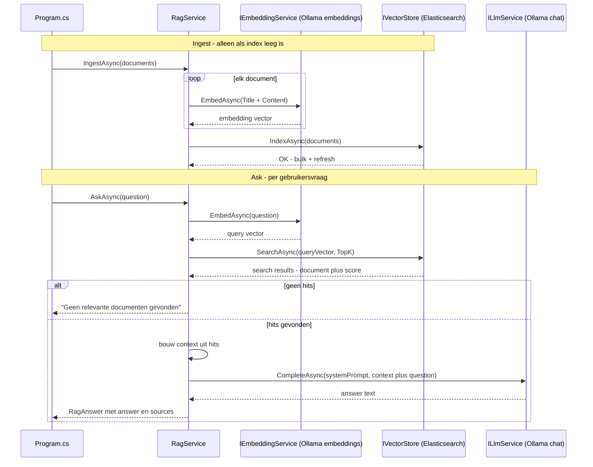
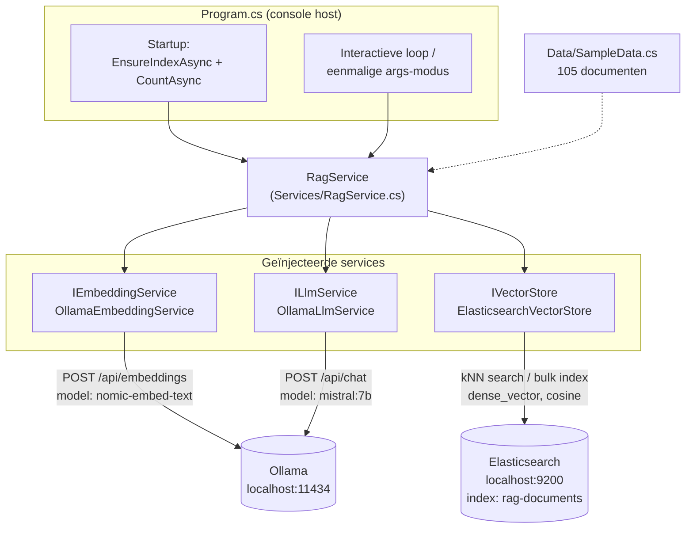
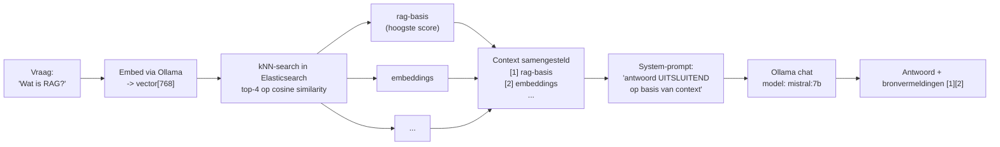

# RAG-pijplijn — diagram

Visuele weergave van [RagService.cs](Services/RagService.cs): de twee
publieke methodes `IngestAsync` en `AskAsync`, en hoe ze de drie services
(`IEmbeddingService`, `IVectorStore`, `ILlmService`) gebruiken.

## Sequence diagram — IngestAsync + AskAsync

## Componentdiagram — architectuur

## Wat er gebeurt bij "Wat is RAG?"

